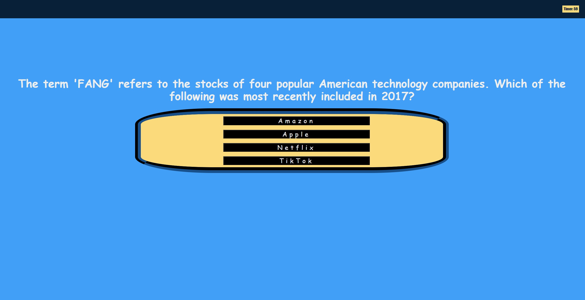
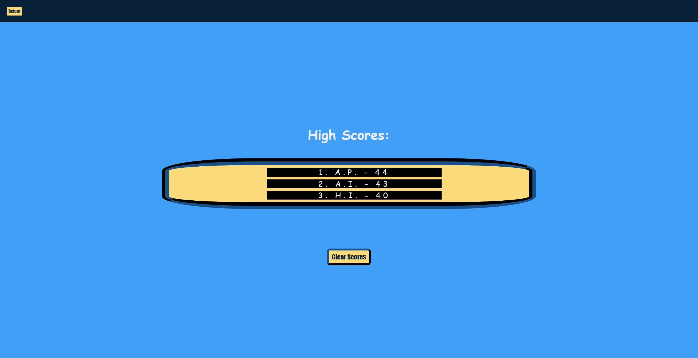

# CWRU Bootcamp Challenge 4 - Programming Quiz

## Description

1. In this challenge, my main goal was to create a programming quiz that allowed functional questioning/answering, score keeping during the quiz, score saving after quiz, and a high score list that showcases these scores.

2. This was a way for to practice concepts we went over in class such as saving/retrieving information from a JSON, event handlers, event listeners and a continued exploration of styling on a page using HTML, CSS and Javascript to accomplish it.

3. Throughout the process, I learned a lot about event handlers, and how exactly I need to work with them to get them to work for me. I explored DOM traversal very heavily in this project, as to make everything actively be culled in and out took a lot of work without switching to a different HTML page. The thing I will say that I am most proud of is my multi-nested array to handle questions, answers, and correct answers.

4. Console.log and Google Dev Tools were integral in navigating through this process with the information they would provide about the arrays, events, etc.

5. The return of the Fisher-Yates shuffle algorithm from my last project, the password generator, was used to shuffle again! This time, it was used throughout to create a more randomized experience each time the quiz is ran.

## Installation and Usage

Simply use the download all of the files provided and open the index.html in your file viewer of choice!
To look at the source code, open it, the CSS file and the Javascript file in a text file editor of choice!

## Mockup:
The following images shows the web application's appearance and functionality:

## Credits
 
 Editing of code done by myself, <b>Anthony Iacano</b>
  
 Fisher-Yates shuffle algorithm used in shuffleArr() developed by <b>Ronald Fisher and Frank Yates<b>
  
 Lesson provided by <b>edX Boot Camps LLC.</b>

## Link to Deployed Page

 https://anthony-gg.github.io/programming-quiz/

 ## License

Please reference the **LICENSE.MD** file inside of the repository.

---